# Love Gym - Quiz

## Purpose

Love Gym is a quiz site that quizzes people's gym knowledge. Love Gym provides an opportunity for learning and testing your knowledge. Love Gym's purpose is to create value by learning about your health and the gym.

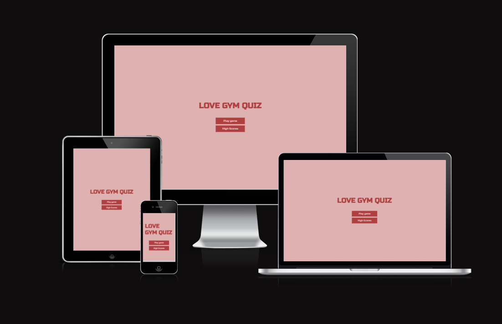

## Planning

### WireFrames

- Below are the wireframes I created to plan the design of the website. Using wireframes helped me work towards a design and have a more focused end product.

- __Home Page__

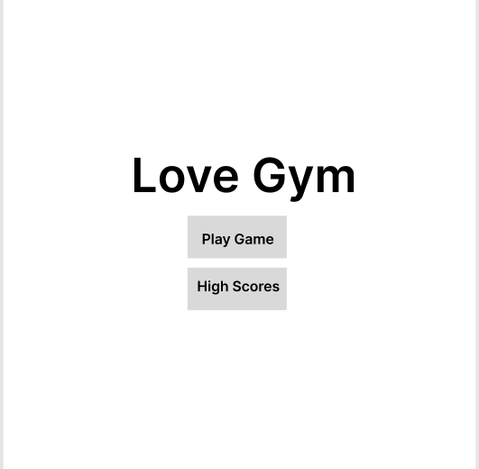

- __Play Game Page__
  
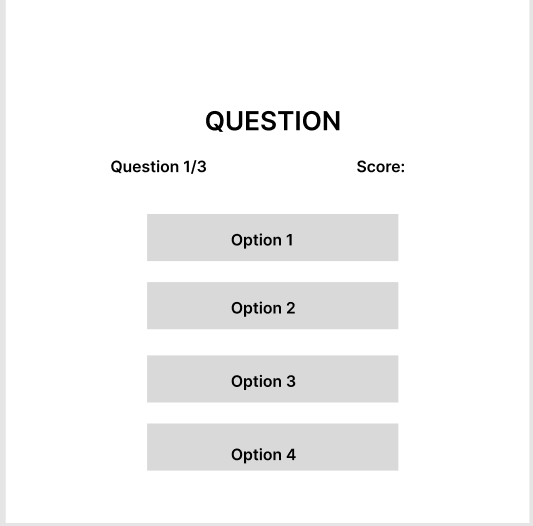 

- __End Game Page__
  
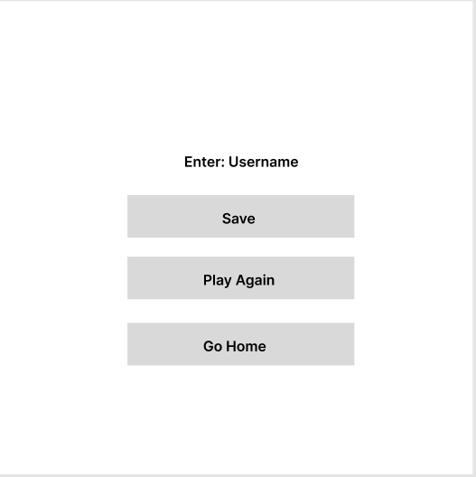

### Colour Scheme

- I have used 3 main colors from the color palette consisting of 5 colors, I have used a series of red, pink and greys.

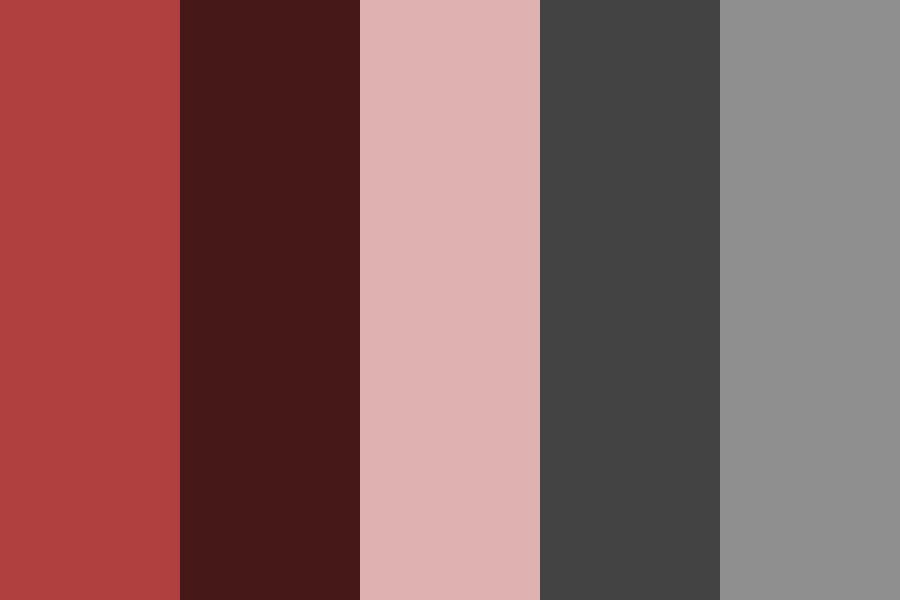

### Typography

- I have used one main font, [Russo One](https://fonts.google.com/specimen/Russo+One?preview.text=GET%20STRONG&preview.text_type=custom&classification=Display). This was to stay consistent throughout the whole website and create a familiarity within the website.

### Target Audience

- I aim to target gym goers who want to test their knowledge.
- I aim to target people who don't know much about the gym and want to learn.
- I aim to target all levels of experience to help give knowledge.

### User Stories

- As a user I want to understand the purpose of the site.
- As a user I want to be able to benefit from the site.
- As a user I want to be able to navigate the site with ease.
- As a user I want to be able to save my score and username.

### Site Aims

- Inform the user about the purpose of the site.
- Provide useful information to the user.
- Allow the user to easily navigate the site.
- Enable the user to gain/test their knowledge of the gym.
- Allow the user to store their score and username.

## Features

### Existing Features

- __The landing/home page__

  - The Love Gym landing page image instantly grabs the attention of the user and notifies them of the purpose of the site.
  - The landing page has a big title that informs them of the purpose of the site.
  - Includes buttons to navigate around the page.

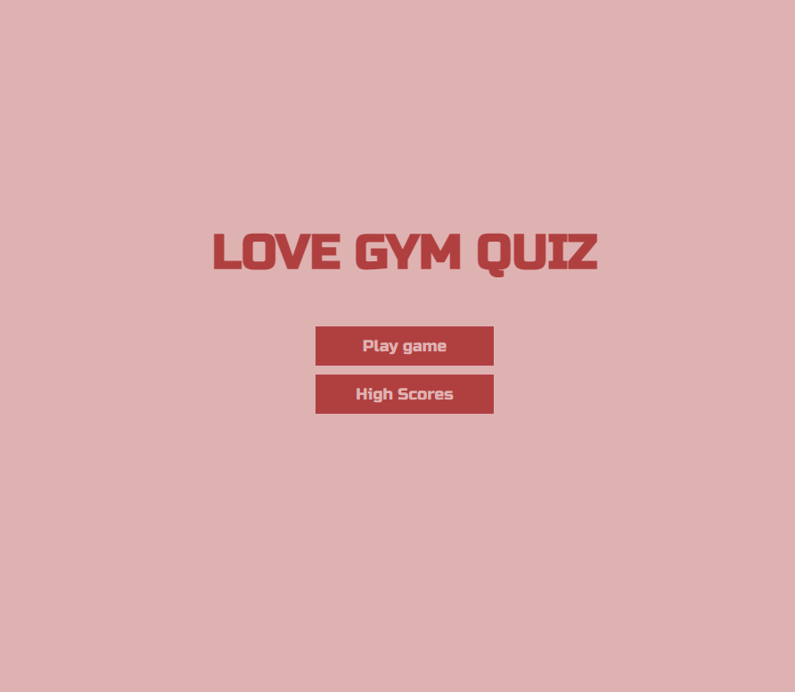

- __Play Game Section__

  - The play game section displays the user with a quiz and HUD to play the game.
  - If the user gets an answer correct a green color is displayed on the answers, if incorrect an orange color is displayed.
  - This allows the user to check their knowledge and know which questions are correct.

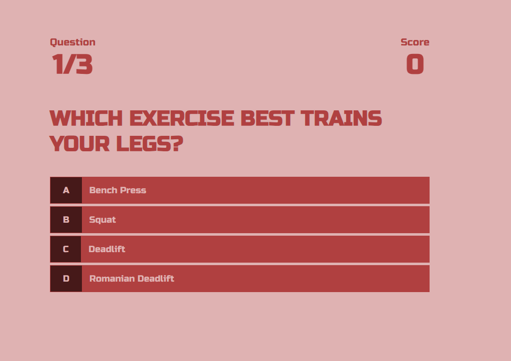

- __End Game Section__

  - This section allows the user to see their score and gives them options to input their username and save their score and name, play again or return home.
  - The end game section is important for the user as it allows them to know that the quiz is over.

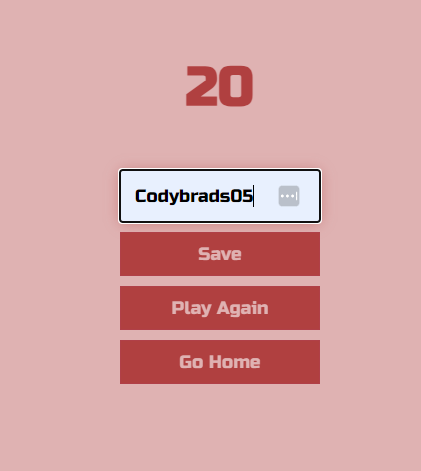

- __High Scores Section__

  - The high scores section displays the score and username submitted by the user, multiple scores and usernames can be submitted. However, data is only stored locally.
  - This adds value for the user as it allows them to track their progress and keep track of their best score.

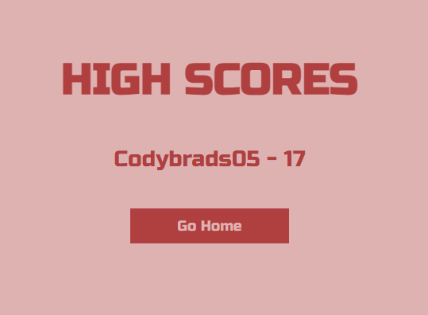

### Features Left to Implement

- In the future, this website will be able to have the following features:
- User scores are saved into a database to make them consistent.
- Different categories of gym quizzes.

## Testing

### Cross-browser Testing

- I have checked my website works on multiple browsers, such as Firefox, Edge, Opera and Chrome.

### Responsive Design Testing

- My responsive design works as intended on all the browsers I have tested.
- I have used websites such as <https://ui.dev/amiresponsive?url=https://codybradbury05.github.io/love-gym/index.html/> to also check whether my responsive design works and looks good.
- I have used the Chrome developer tools to check my responsive design works, testing on all different screen sizes. For example, Galaxy Fold, iPad Mini, Google Nest Hub Max.

### Readability

- I have clarified through myself and others that my design is readable and easy to understand as well as my design being consistent via colours, fonts and images.

### Usability

- I have tested that everything the user can interact with works as intended. As follows, all buttons work on click and give a response when hovered over. My quiz fully works and gives user feedback on whether a question is right, as well as tracks the score and number of questions. The username and score are saved to the high score page.

### Validator Testing

- No errors were returned when passing through the official [W3C validator](https://validator.w3.org)
- No errors were found when passing through the official [(Jigsaw) validator](https://jigsaw.w3.org/css-validator/validator#css)
- No errors were found when passing through the website [validatejavascript.com](https://validatejavascript.com/)

### Lighthouse Testing

- I used Lighthouse to test other areas of my website, all tests were completed on the mobile side. Accessibility was lower due to the contrast of colors, not a high enough ration. This is something I could change in the future by using a higher color contrast ratio.

### Home Page
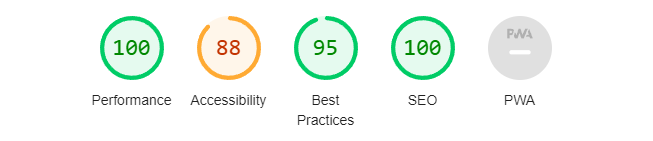

### Play Game Page
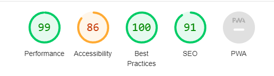

### End Game Page
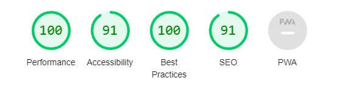

### High Score Page
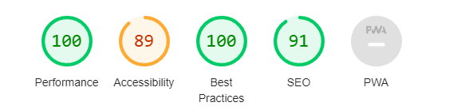

### Bugs

- The first bug I found was my buttons not directing to a new page, this was a file path problem and due to my deploying my page early, I was able to solve this problem.

## Deployment

- The site was deployed to GitHub pages. The steps to deploy are as follows:
  - In the GitHub repository, navigate to the Settings tab
  - From the source section drop-down menu, select the Master Branch
  - Once the master branch has been selected, the page will be automatically refreshed with a detailed ribbon display to indicate the successful deployment.
  - Due to me deploying the site early, it helped me spot any potential bugs early on the deployed site. This helped me to negate any problems that would have not shown on the live server.

The live link can be found here - <https://codybradbury05.github.io/love-gym/highscores.html/>

## Technology

The Technologies used are stated below: 

- HTML
- CSS
- JavaScript

## Credits

### Content

- The code used to make the quiz was used and changed from youtuber James Q Quick[James Q Quick](https://www.youtube.com/watch?v=rFWbAj40JrQ&list=PLB6wlEeCDJ5Yyh6P2N6Q_9JijB6v4UejF&index=3)
- The Font was from. [Google Fonts](https://fonts.google.com/)
- Color Palette was from. [color-hex.com](https://www.color-hex.com/color-palette/26063)

### Media

- The favicon was created on [favicon.io](https://favicon.io/favicon-generator/)
- Wireframes were created on [Figma.com](www.figma.com)